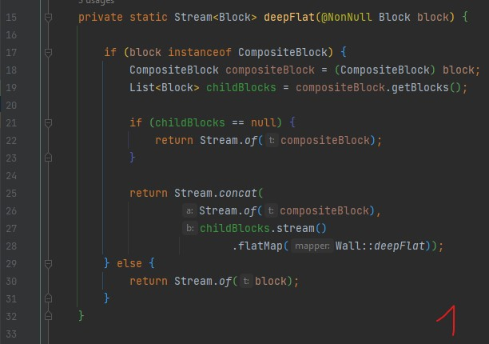
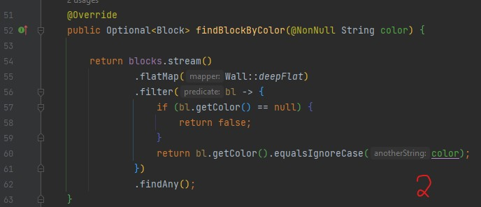
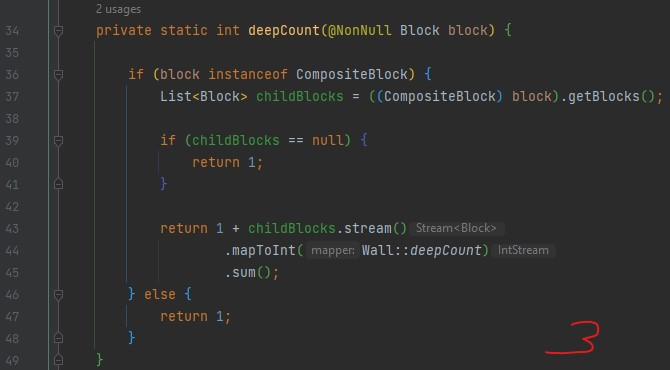
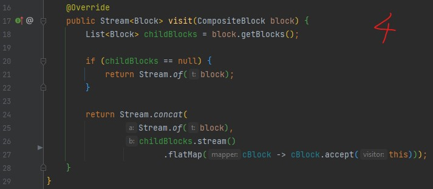
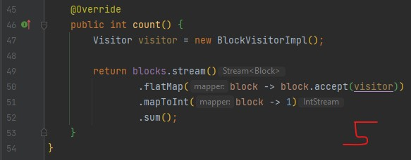

# UPDATE 11.02.2023
Po głębszej analizie zadania zdecydowałem się na zmianę implementacji.

W tym celu wykorzystałem wzorzec projektowy **Visitor**. 

Pozostawiłem też poprzednią implementację opartą na rekurencji.

# Zadanie rekrutacyjne dla firmy Horus

I. [Treść zadania](#i-treść-zadania)

II. [Podejście z wykorzystaniem wzorca Visitor](#ii-podejście-z-wykorzystaniem-wzorca-visitor)

III. [Podejście rekurencyjne](#iii-podejście-rekurencyjne)

IV. [Analiza](#iv-analiza)

V. [Założenia](#v-założenia)

VI. [Implementacja rekurencyjna](#vi-implementacja-rekurencyjna)

VII. [Implementacja z wykorzystaniem wzorca projektowego Visitor](#vii-implementacja-z-wykorzystaniem-wzorca-projektowego-visitor)

VIII. [Podsumowanie](#viii-podsumowanie)

# I. Treść zadania
Poniżej przekazujemy zadanie z prośbą o analizę poniższego kodu i zaimplementowanie metod:
* findBlockByColor
* findBlocksByMaterial
* count

w klasie Wall najchętniej unikając powielania kodu i umieszczając całą logikę w klasie Wall.

Z uwzględnieniem w analizie i implementacji interfejsu CompositeBlock!

# II. Podejście z wykorzystaniem wzorca Visitor

### Composite pattern
Możemy zaobserwować, że w naszym przykładzie występuje wzorzec projektowy **Composite**.

Przypomina on strukturę odwróconego drzewa, gdzie węzły to obiekty typu **CompositeBlock** a liście to obiekty typu **Block**.

### Visitor pattern
W celu wykonania zadania, a więc implementacji metod **findBlockByColor**, **findBlocksByMaterial** oraz **count** 
narzuca się wykorzystanie wzorca projektowego **Visitor**, który jest często używany wraz ze wzorcem **Composite**.

Implementacja wzorca **Visitor** pozwoli nam na odwiedzenie każdego elementu w drzewie i zwrócenie interesujących nas informacji.

# III. Podejście rekurencyjne
W związku z dosłowną interpretacją treści zadania pierwotnie zdecydowałem się na implementację czysto rekurencyjną, 
tak, aby ograniczyć całą implementację do metod klasy **Wall**. Rozwiązanie pozostawiłem w celach porównawczych. 

Preferuję jednak podejście z wykorzystaniem wzorca projektowego **Visitor**.

# IV. Analiza
Jako że **CompositeBlock rozszerza Block** implementacja interfejsu CompositeBlock narzuca na **klasę implementująca** interfejs CompositeBlock implementację metod z interfejsu Block oraz CompositeBlock.

W przypadku metody **getBlocks()** sprawa wydaje się oczywista, metoda zwraca po prostu listę obiektów typu Block. Warto jednak zauważyć, że mogą to być również elementy typu **CompositeBlock!**

Narzuca się jednak myśl co oznacza metoda **getColor()** oraz **getMaterial()** w interfejsie **CompositeBlock**.

Oczywiście interfejs nie narzuca klasie go implementującej, w jaki sposób metody mają zostać zaimplementowane, jednak (metody interfejsu **CompositeBlock**):

* **getBlocks()**

Żadna specyfikacja / implementacja **nie wskazuje**, że obiekt klasy implementującej **CompositeBlock** musi składać się z >=1 ilości Block.

Być może w jednym z (wielu różnych) przypadków istotna jest tylko informacja, że obiekt jest typu **CompositeBlock**, co może oznaczać, że składa się z kilku Block, jednak (odwołanie do świata rzeczywistego) np. producent nie chce podawać tej informacji (oczywiście nie oznacza to, że tych informacji nie da się ukryć), zaś dla klienta istotny jest materiał i kolor, a nie ilość elementów z których ten blok się składa.

* **getColor()**

Nazwa metody sugeruje, że obiekt klasy implementującej **CompositeBlock** posiada **jeden kolor** mimo, że może składać się z **wielu bloków** (getBlocks), które mogą posiadać różne kolory (o ile implementacja nie stanowi inaczej).

Oczywiście jesteśmy sobie to w stanie wyobrazić (prawdopodobnie w naszym przykładzie odwzorowujemy element świata rzeczywistego). Nasz CompositeBlock składający się z kilku (w tym przypadku >= 1) bloków może zostać “przemalowany”, zaś bloki z których się składa oryginalnie będą posiadały inne kolory.

Oczywiście zawsze można zwrócić wartość null jako flagę oznaczającą, że CompositeBlock składa się z kilku kolorów materiałów.

Warto też rozważyć to o czym napisano w opisie metody **getBlocks()**.

* **getMaterial()**

Nazwa metody sugeruje, że klasa implementująca **CompositeBlock** składa się z jednego materiału, mimo, że może składać się z wielu bloków (getBlocks) o różnych rodzajach materiałów.

W tym przypadku ciężko odwołać się do przykładu ze świata rzeczywistego. Prawdopodobnie klasa implementująca CompositeBlock powinna zwracać w metodzie getBlocks() listę bloków o takim samym rodzaju materiału w innym przypadku warto się zastanowić czy poprawnie zaprojektowano ten interfejs.

Oczywiście zawsze można zwrócić wartość null jako flagę oznaczającą, że CompositeBlock składa się z kilku rodzajów materiałów.

Warto też rozważyć to o czym napisano w opisie metody **getBlocks()**.

# V. Założenia

Jako, że nie posiadam szczegółowej specyfikacji dotyczącej implementacji metod **findBlockByColor()**, **findBlockByMaterial()**, **count()**, 
przy ich implementacji postarałem się stworzyć jak najbardziej uniwersalne rozwiązanie. Poniżej przedstawiam moje założenia uwzględnione w implementacji.

## 1. **Optional\<Block\> findBlockByColor(String color)**

1.1 W poszukiwaniach **Block** o określonym kolorze należy uwzględnić:

1.1.1 Kolor Block’u zwracany przez metodę getColor() - obiekt klasy implementującej interfejs Block.

1.1.2 Kolor Block’u zwracany przez metodę getColor() - obiekt klasy implementującej interfejs CompositeBlock.

1.1.3 Kolor Block’u zwracany przez metodę getColor() wywołaną na każdym obiekcie typu Block znajdującym się wewnątrz listy List\<Block\>  zwracanej przez metodę getBlocks() (pochodzącej z obiektu typu CompositeBlock).

**Podsumowanie**
Zakładamy, że kolor zwracany przez metodę getColor() w obiekcie typu CompositeBlock może się różnić od kolorów opisanych w 1.1.3.

1.2 Uwzględnić, że List\<Block\> zwracana przez metodę getBlocks() w obiekcie typu CompositeBlock może zawierać listę obiektów implementujących CompositeBlock.

1.3 **getColor()** moźe zwrócić null.

1.4 **findBlockByColor(@NonNull String color)** - parametr jawny color nie może być null.

## 2. **public List\<Block\> findBlocksByMaterial(@NonNull String material)**

2.1 W poszukiwaniach List\<Block\> o określonym materiale **należy uwzględnić**:

2.1.1 Materiał Block’u zwracany przez metodę getMaterial() - obiekt klasy implementującej interfejs Block.

2.1.2 Materiał Block’u zwracany przez metodę getMaterial() - obiekt klasy implementującej interfejs CompositeBlock.

2.1.3 Materiał Block’u zwracany przez metodę getMaterial() wywołaną na każdym obiekcie typu Block znajdującym się wewnątrz listy List\<Block\>  zwracanej przez metodę getBlocks() (pochodzącej z obiektu typu CompositeBlock).

**Podsumowanie**
Zakładamy, że materiał zwracany przez metodę getMaterial() w obiekcie typu CompositeBlock może się różnić (z jakiegoś nieznanego mi powodu) od materiałów opisanych w 2.1.3.

2.2 Uwzględnić, że List\<Block\> zwracana przez metodę getBlocks() w obiekcie typu CompositeBlock może zawierać listę obiektów implementujących CompositeBlock.

2.3 **getMaterial()** moźe zwrócić null.

2.4 **findBlocksByMaterial(@NonNull String color)** - parametr jawny color nie może być null.

## 3. public int count()

Metoda zlicza liczbę wszystkich **Block**, z których składa się nasz Wall. W obliczeniach bierzemy pod uwagę również bloki typu **CompositeBlock** oraz wszystkie ich **childrens** pochodzące z **getBlocks()**.

# VI. Implementacja rekurencyjna

* Implementację odnajdziemy w klasie **org.wall.WallRecursive**
* Testy jednostkowe odnajdziemy w klasie **WallRecursiveTest**

**Legenda:**

**[X:LY]** - odwołanie do danej linijki kodu, gdzie **X** oznacza numer obrazu, a **Y** oznacza numer linijki. np. [1:L15]	

## Szczegóły implementacji	

### 1. **Optional\<Block\> findBlockByColor(String color)**
W związku z tym o czym wspomniano w punkcie V.1.2 w celu maksymalnie uniwersalnego rozwiązania zadania narzuca się wykorzystanie **rekurencji** (Niewykluczone jest również zastosowanie innego rozwiązania (bez rekurencji).  W tym celu stworzono **metodę pomocniczą**: 

* private static Stream\<Block\> **deepFlat**(@NonNull Block block) 
	
Metodę **deepFlat** wywołujemy (w metodzie **findBlockByColor**) na każdym elemencie strumienia [2:L55] utworzonego z private **List\<Block\> blocks** (pole klasy Wall). 

Metoda **deepFlat** zwraca Strumień: **Stream\<Block\>** [1:L15], zawierający zarówno element strumienia przekazany jako argument do tej metody [1:L26] (**@NonNull Block block**) jak i wszystkie jego dzieci [1:L27] (**childrens**) będące wynikiem wywołania na nim metody getBlocks() [1:L19], o ile aktualnie rozpatrywany element strumienia jest typu CompositeBlock [1:L17], jeżeli jest tylko typu **Block** [1:L30] (lub **childBlocks == null** [1:L21]) mamy do czynienia z tzw. przypadkiem podstawowym w rekurencji. Dzięki temu w poszukiwaniach Block o zadanym kolorze uwzględnimy wszystkie Block (nawet te pochodzące z metody **getBlocks()** [1:L19]). Pamiętajmy, że wspomniane **childrens**, również mogą posiadać **childrens** stąd zastosowanie rekurencji. 

   

Metoda **findBlockByColor** wykorzystuje metodę **deepFlat** [2:L55] wewnątrz metody **flatMap** [2:L55] wykonywanej na **każdym** elemencie strumienia. Dzięki temu uzyskujemy jeden strumień składający z wszystkich możliwych Block. W tym momencie wystarczy tylko odpowiednio **pofiltrować** [2:L56] wyniki i zwrócić **wynik**.

   

### 2. **public List\<Block\> findBlocksByMaterial(@NonNull String material)**

Metoda działa na bardzo podobnej zasadzie jak ta opisana w punkcie 1.

### 3. public int count()

   Metoda zlicza liczbę wszystkich Block, z których składa się nasz Wall. W obliczeniach bierzemy pod uwagę również bloki typu CompositeBlock oraz wszystkie ich childrens pochodzące z getBlocks(). W związku z tym zastosowano metodę pomocniczą:

* private static int **deepCount**(@NonNull Block block)

	Metoda **deepCount** działa na podobnej zasadzie jak **deepFlat**, poniżej opisano tylko kilka istotnych informacji:

* [3:L43] Istotne jest to, że dodajemy jedynkę do sumy wszystkich bloków (dzieci) wew. **CompositeBlock**, która oznacza, że w obliczeniach należy również wziąć pod uwagę również **CompositeBlock**.
* [3:L47] Jeżeli blok jest tylko typu Block oznacza to, że z pewnością nie ma childrens więc zwracamy 1 (przypadek podstawowy)
* [3:L40] Skoro **CompositeBlocks** nie ma childrens (**getBlocks == null**) zwracamy tylko 1 reprezentującą istnienie CompositeBlocks.

   

# VII. Implementacja z wykorzystaniem wzorca projektowego **Visitor**
* Implementację metod odnajdziemy w klasie **org.wall.Wall**
* Implementację wzorca projektowego **Visitor** odnajdziemy w pakiecie **org.Visitor**
* Testy jednostkowe odnajdziemy w klasie **WallTest**

**Legenda:**

**[X:LY]** - odwołanie do danej linijki kodu, gdzie **X** oznacza numer obrazu, a **Y** oznacza numer linijki. np. [1:L15]

## Informacja wstępna
* Poniżej wyjaśniono tylko najważniejsze szczegóły implementacji. 
* Poczynione założenia przy implementacji są identyczne jak w przypadku implementacji rekurencyjnej.

## Szczegóły implementacji
### 1. Implementacja wzorca **Visitor** składa się z:
* **Interfejsu Visitor** 
   * Posiadającego dwie metody **visit:**
      * Stream<Block> visit(**Block block**) 
      * oraz Stream<Block> visit(**CompositeBlock block**);
   * Każda z metod przeznaczona jest dla odpowiedniego typu Block.
   * Interfejs ten jest implementowany przez klasę **BlockVisitorImpl**.

* **Interfejsu Visitable**
   * Posiadającego jedną metodę **accept:**
      * Stream<Block> accept(**Visitor visitor**);
   * Interfejs ten jest implementowany przez klasę **Block** oraz **CompositeBlock**.

* **Klasy BlockVisitorImpl**
   * Implementuje interfejs **Visitor**.

**Podsumowanie:**

Jak możemy zaobserwować zaimplementowane metody **visit** zwracają **Stream\<Block\>**
składający się z wszystkich elementów węzła (w tym węzła głównego) oraz jego dzieci.

### 2. Wybrane fragmenty kodu

* Implementacja metody public **Stream<Block> visit(CompositeBlock block)**
   * [4:L27] **Istotna linijka** kodu pozwalająca w sposób **polimorficzny** wywołać metodę **visit** dla odpowiedniego typu Block.
      * Zauważmy, że zamiast [4:L27] wywołanie **.flatMap(this::visit)** byłoby błędem, ponieważ wtedy wywoływalibyśmy metodę **visit** dla typu **Block** (Nigdy dla **CompositeBlock**). W tym przypadku nie chcemy dodakowo używać instrukcji if i operatora **instanceof**.

   

* Implementacja metody **public int count()**
  * [5:L50] Spłaszcza zawartość strumieni zwracanych przez metodę **accept** do jednego strumienia.
  * [5:L51] Mapuje każdy element strumienia na wartość 1.
  * [5:L52] Sumuje wszystkie wartości zwrócone przez mapowanie.
  * Dzięki powyższemu rozwiązaniu nie musimy tworzyć dodatkowej metody w klasie **BlockVisitorImpl**.

   

# VIII. Podsumowanie
* Projekt wykonano w **Javie 11** oraz skorzystano z **lombok** oraz **junit**.

* Skorzystano z 2 sposobów rozwiązania problemu. **Preferowany sposób:** wykorzystanie wzorca projektowego **Visitor**.

* Wszystkie publiczne funkcje zostały poddane **testom jednostkowym.** 
   * **Warto zaglądnąć** do tych klas, aby dokładniej zrozumieć co powinny zwracać zaimplementowane metody. 
   * Oba sposoby implementacji posiadają **identyczne** testy jednostkowe.

* W razie potrzeby można rozważyć możliwość tego, iż Block może być null (w naszym przykładzie spowoduje to wyjątek). Jednak jeżeli dopuszczalibyśmy wartość null to np. w funkcji zliczającej ilość elementów wystarczy zwrócić 0.
